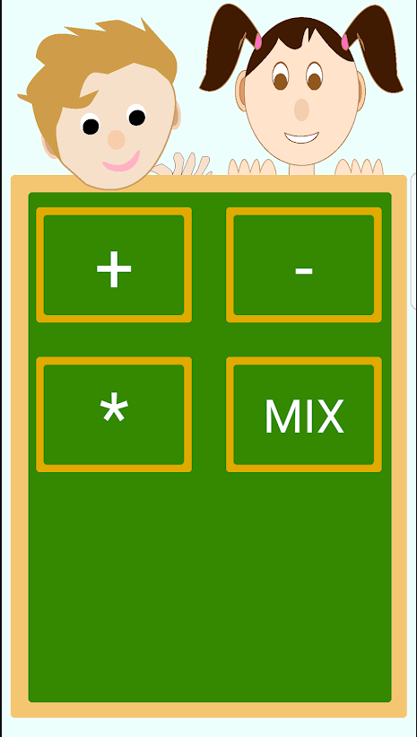
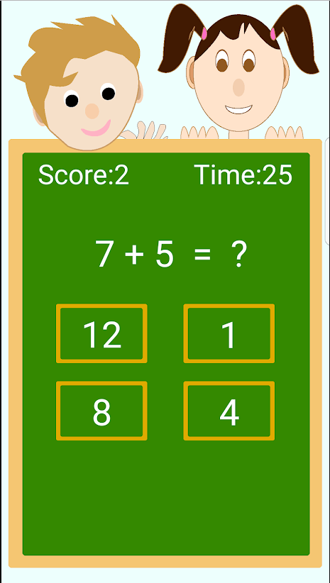
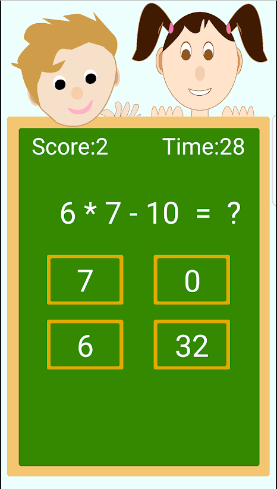

# KidsMathForFree
Kids Math is a free game for the kids to help them to improve their mathematical skills.This game have four main following sections :

1. Addition Test : In this section , kids will get questions to find sum of two numbers.

2. Subtraction : In this section , kids will get questions to find subtraction between two 
numbers.

3. Multiply : In this section , kids will get questions to find multiplication of two numbers.

4. Mix : This section is bit tough as compared to the above sections because In this section , kids will get some advanced questions.

# Screenshots

# Link to Google Playstore

https://play.google.com/store/apps/details?id=game.kamal.com.kidsmathforfree

